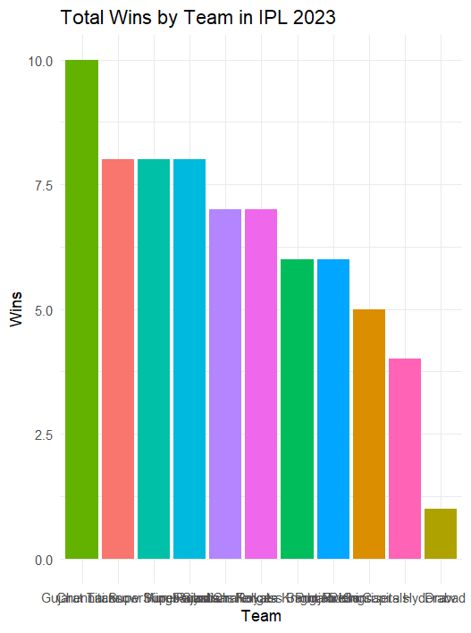
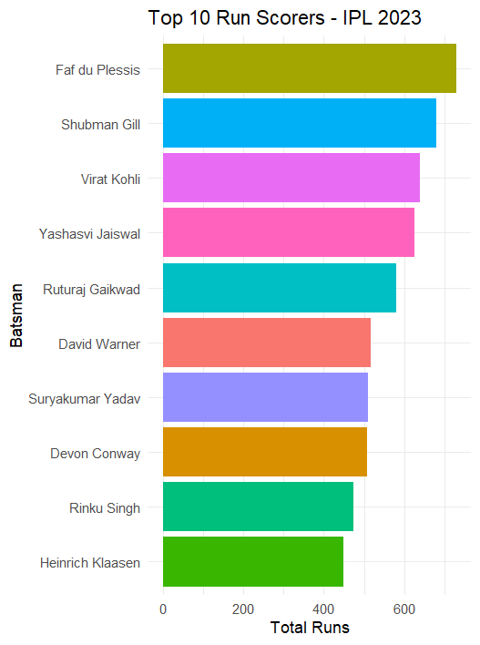
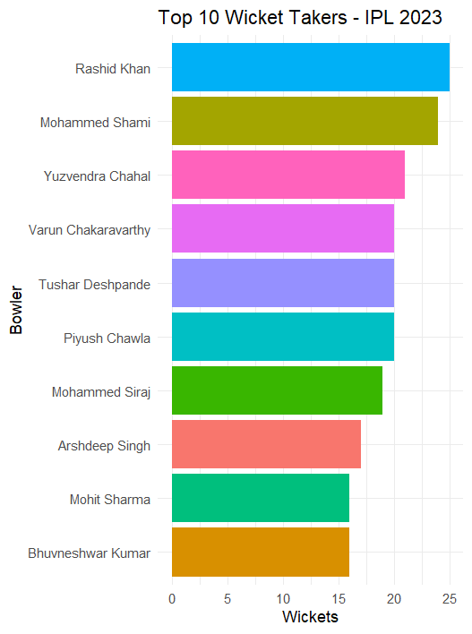

## IPL 2023 Data Analysis using R

This project analyzes the 2023 Indian Premier League (IPL) season using R. It includes team performance, top batsmen, and top bowlers based on official match data.

## Features
- Total wins by team
- Top 10 run scorers
- Top 10 wicket takers
- Data visualization using `ggplot2`

## Tools & Libraries
- R
- tidyverse
- janitor
- lubridate
- ggplot2

## Visualizations

### Total Wins by Team – IPL 2023

### Top 10 Run Scorers – IPL 2023

### Top 10 Wicket Takers – IPL 2023

## Dataset
The data used includes:
- IPL2023_Matches.csv
- IPL2023_Batsman.csv
- IPL2023_Bowler.csv
- IPL2023_Match_Scoreboard.csv

> Note: Data is assumed to be sourced from public or internship sources. Not included here if proprietary.

## Author
[Darshna Jain](https://github.com/Darshnajain11)

